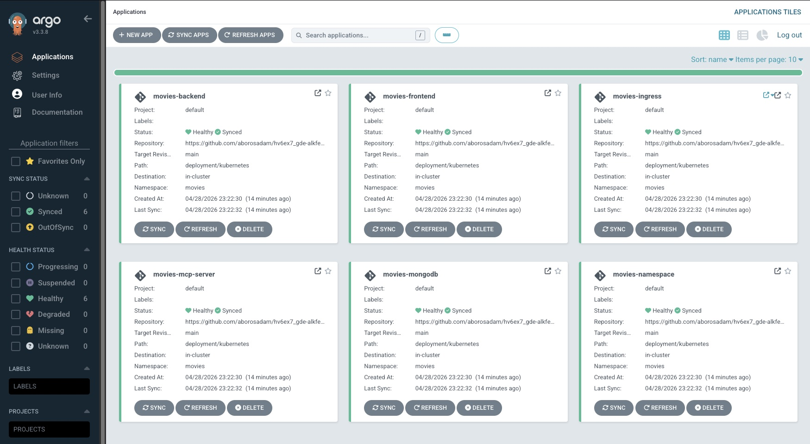
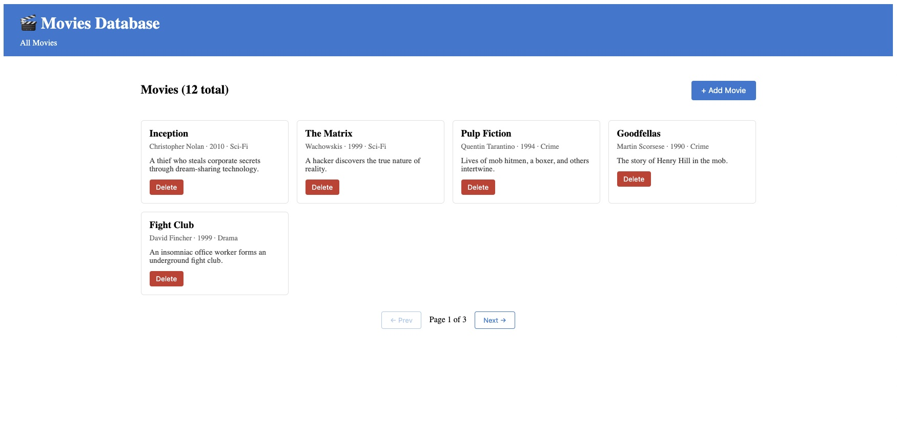
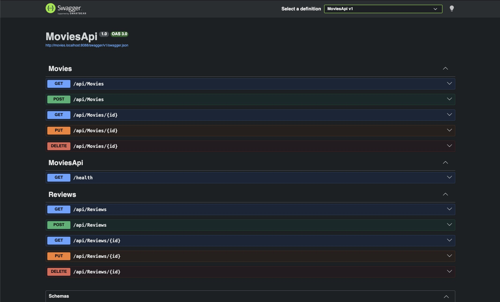

# Movies Database — Alkalmazásfejlesztési technológiái beadandó

Filmnyilvántartó alkalmazás ASP.NET 10 backend + Angular 21 frontend + MongoDB stack-kel, konténerizálva, Kubernetes klaszteren telepíthetően.

## Tech stack

- **Frontend:** Angular 21, TypeScript
- **Backend:** ASP.NET 10, C#
- **Database:** MongoDB 8
- **Container:** Docker
- **Orchestration:** Kubernetes (Docker Desktop K8s)
- **Ingress:** nginx-ingress
- **CI/CD:** GitHub Actions
- **Image registry:** GitHub Container Registry (ghcr.io)

## CD pipeline (ArgoCD)

Az alkalmazás ArgoCD GitOps módon is deploy-olható. Az `deployment/argocd/apps.yaml` 6 ArgoCD Application-t definiál, amelyek figyelik a `deployment/kubernetes/` mappát, és bármely változást automatikusan szinkronizálnak a klaszterre.



Részletes telepítési útmutató: [INSTALL.md - ArgoCD szekció](docs/INSTALL.md#telepítés-argocd-vel-cd-pipeline)

## Funkcionalitás

- Filmek listázása paginálva
- Filmek létrehozása, szerkesztése, törlése (CRUD)
- Filmekhez értékelések hozzárendelése (1-5 csillag + komment)
- Átlagos értékelés számolása
- Két nézet: filmlista + film részletek

## Screenshots

### Movies Database UI



### Swagger API documentation



## Container images

A CI build automatikusan publikálja az image-eket:

- Backend: `ghcr.io/aborosadam/movies-api:latest`
- Frontend: `ghcr.io/aborosadam/movies-frontend:latest`

## Repo struktúra

```
hv6ex7_gde-alkfej-beadando/
├── .github/workflows/    GitHub Actions CI workflows
├── backend/MoviesApi/    ASP.NET backend (C#)
├── frontend/movies-app/  Angular frontend (TypeScript)
├── deployment/
│   ├── docker/          docker-compose.yml
│   └── kubernetes/      K8s manifests + Helm chart
├── http-requests/       .http fájlok (REST tesztek)
├── docs/                INSTALL.md, USER_GUIDE.md
└── README.md
```

## Dokumentáció

- [Telepítési útmutató](docs/INSTALL.md) — helyi Kubernetes telepítés
- [Felhasználói útmutató](docs/USER_GUIDE.md) — az alkalmazás használata

## Gyors indítás (Docker Compose)

```bash
cd deployment/docker
docker compose up -d
```

Megnyitás: http://localhost:8081

## CI/CD

A `main` branch-re történő push automatikusan:
1. Lebuildeli az érintett komponens(ek) Docker image-ét
2. Feltölti az image-eket a `ghcr.io`-ba
3. Image tagek: `latest`, `<branch>`, `<short-SHA>`

Manuális trigger a GitHub Actions UI-ról is lehetséges.

## Licenc

MIT